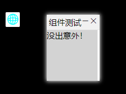
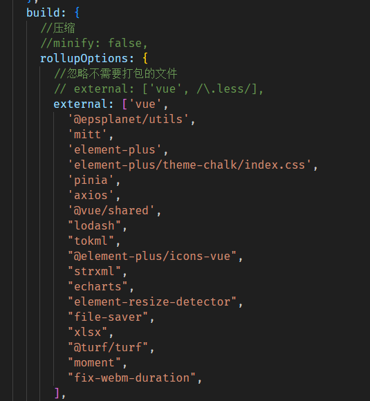
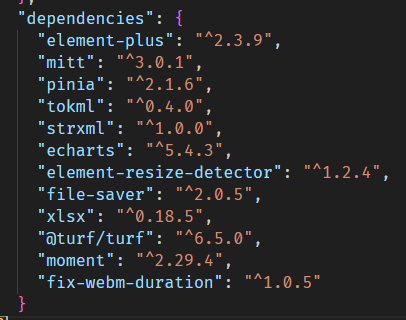

1. ## 在哪开发组件？组件结构是什么样？

   ***packages>components>src>***

   在对应的分类下，仿照其他组件，新建一个即可，组件结构至少包括一个功能主体vue文件和一个用于注册和导出的index.ts文件，组件props参数、样式等文件可以根据需要增加。

   - componentA                           
     - componentA.vue(必须)
     - index.ts(必须)
     - style(样式)
     - componentA.ts(组件props参数)

   > 注意：记得要导出你的组件
   >
   > 在各类组件文件夹下的index.ts中导出组件，在components.d.ts中导出组件类型

2. ## 如何调试我在开发的组件？

   在确保组件已经创建好并且正确导出后，就可以在测试项目play中测试。

   ```vue
   <EpsplanetButton :title="'组件测试'" :icon="'icon-tool_wsjg'" type="panel" :position="position" :panel="panel">
    	<EpsplanetComponentA />
   </EpsplanetButton>
   ```

   把组件直接放到按钮里，在界面上点击按钮，不出意外的话就能看到你的组件面板了！

   
   
3. ## 怎么打包？打包打到哪里了？

   打包：把终端定位到组件库根目录，执行一下命令

   ```node
   npm run build:pack
   ```

   打包位置：***packages>epsplanet***

   > 注意：打包完需要检查一下，epsplanet>lib目录下是否有index.js入口文件，如果没有那就是打包失败了，如果看到目录下还有node_modules文件夹，那就是你新增了某些依赖，处理方式如下
   >
   > 把你新增的依赖添加到：packages>components>vite.config.ts
   >
   > 
   >
   > 同时在packages>epsplanet>package.json中添加
   >
   > 
   >
   > 把打包目录下的es和lib文件夹删除后重新执行打包命令即可。

